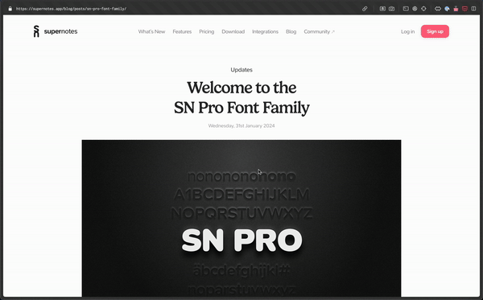

# Sn Web Clipper - Unofficial Web Clipper Extension or Supernotes.

- CMD+Shift+Y to open the extension.
- CMD+Enter to save just like you're using Supernotes.

## Usage 
- Get API Key from your Supernotes (Settings > API & Intergrations > Manage API Keys) 
- Right click the Extension Icon > Option > Save your API Key to the extension.
- CMD+Shift+Y or click the icon to open the extension.
- CMD+Enter or click "Capture" to save just like you're using Supernotes.

## Credit
- [Supernotes](https://supernotes.app/)
- [Suprnotes API](https://developer.supernotes.app/api-reference/introduction)
- [Icon: Freepik - Flaticon](https://www.flaticon.com/free-icons/clip)